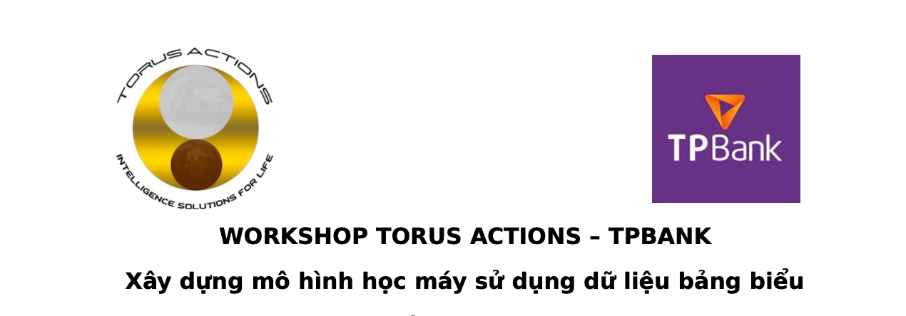

## Instructors
* Nguyễn Hoàng Phương  - Data Scientist từ Torus-Actions

## Tổng quan về workshop

Workshop nhằm chia sẻ kiến thức về kỹ năng xây dựng mô hình AI/ML sử dụng dữ liệu bảng biểu cho các nhân sự của TPBank và Torus-Actions. Nội dung workshop gồm 2 phần chính. 

#### Phần thứ nhất: Bài toán regression - Xây dựng mô hình dự đoán giá nhà

Giới thiệu tổng quan về cách tiếp cận giải quyết bài toán regression thông qua dữ liệu của cuộc thi [House prices](https://www.kaggle.com/c/house-prices-advanced-regression-techniques).  Phần này sẽ giới thiệu qua về các hạng mục chính như xây dựng mô hình cơ bản (khai phá dữ liệu, Xử lý dữ liệu, xây dựng mô hình cơ bản, tối ưu bayes, thuật toán lightgbm,  finetune tham số ,…)

#### Phần thứ hai: Bài toán Classification - Xây dựng mô hình chấm điểm tín dụng

Giới thiệu tổng quan về cách tiếp cận giải quyết bài toán classification, thông qua sử dụng các kỹ thuật phổ biến áp dụng trực tiếp cho dữ liệu của TPBank khi xây dựng mô hình đánh giá tín nhiệm KH. Giới thiệu các điểm quuan trọng khi thu thập và xử lý dữ liệu để xây dựng mô hình dự đoán, các lưu ý quan trọng khác cho bài toán thực tế. 
   

## Tham khảo

#### Kaggle 
   + [House prices competition](https://www.kaggle.com/c/house-prices-advanced-regression-techniques)
   + [Comprehensive data exploration](https://www.kaggle.com/pmarcelino/comprehensive-data-exploration-with-python)
   + [Stacked regressions to predict  House Prices](https://www.kaggle.com/serigne/stacked-regressions-top-4-on-leaderboard)
        
#### Coursera
   + [Applied Data Science with Python](https://www.coursera.org/specializations/data-science-python) 
   + [Data Visualization with Python](https://www.coursera.org/learn/python-for-data-visualization)

 

        
## Yêu cầu cài đặt 

python 3.7

numpy==1.19.3
scipy==1.5.3                    
matplotlib==3.3.2
seaborn==0.11.0
scikit-learn==0.23.2  
xgboost==1.2.1  
lightgbm==3.0.0         
bayesian-optimization==1.2.0
plotly
pandas==0.23.1
h2o
unidecode==1.1.1
xlrd
plotly
cufflinks
nbformat

## Download notebook

